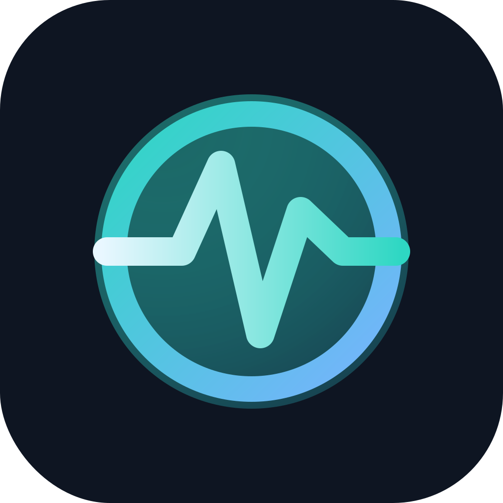
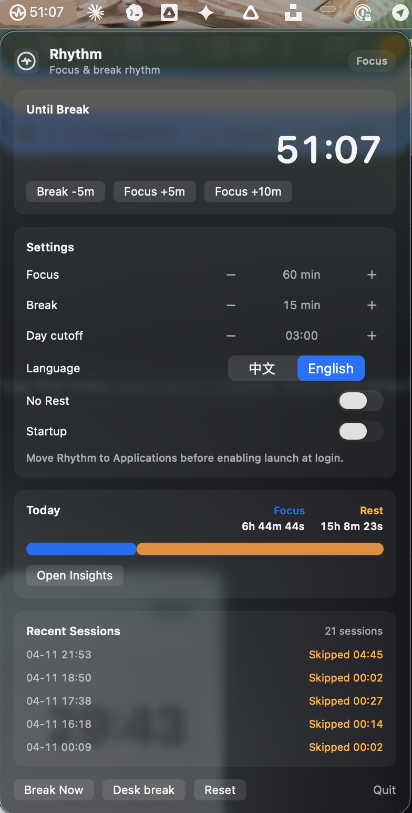
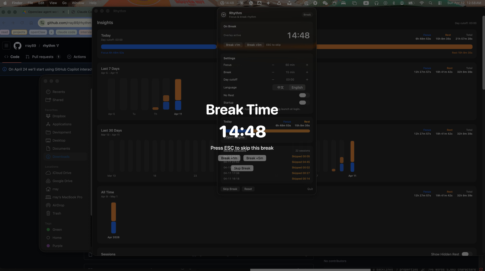

# Rhythm

**English** | [中文](README.zh.md)

Rhythm is a macOS rhythm reminder app that helps users build a steadier focus-and-break cadence while using their computer.



## UI Preview





## Docs

This README describes the behavior currently shipped in this fork. If you want to separate the upstream V1 baseline from the fork's next direction, use these docs together:

- [Chinese README](README.zh.md): Chinese version of the shipped README
- [V1 Design Doc](docs/V1-design.md): historical upstream `main` baseline and design record
- [V2 PRD (Chinese / Fork Draft)](docs/V2-prd.zh.md): current fork baseline and next-stage direction
- [V2 PRD (English / Fork Draft)](docs/V2-prd.en.md): English companion version of the fork baseline and roadmap

## Current Features

- Custom rhythm: configurable focus interval from 10 to 120 minutes in 5-minute steps, plus configurable break duration from 30 seconds to 20 minutes using common presets
- Temporary phase controls: supports `Start Break 5 Minutes Early`, `Extend Focus 5 Minutes`, `Extend Focus 10 Minutes`, and extending the current break phase
- Bilingual UI: supports `中文` and `English`; first launch defaults to Chinese only for `zh*` system languages, and English otherwise
- Daily totals: the menu keeps a compact `Today` summary with inline `Focus` / `Rest` totals and a quick path into Insights
- Insights window: open a dedicated window from the menu for `Today`, `Last 7 Days`, `Last 30 Days`, and `All Time` summaries, compact range totals, a day-based sessions browser, and scoped export
- Day cutoff: reporting for "today" can be shifted anywhere from `00:00` to `23:00`
- No-rest mode: automatically skips breaks when enabled and records the skipped break session
- Hidden screen-lock rest: locking the screen ends the current focus or break segment, counts lock-to-unlock time as rest, and starts a fresh focus cycle on unlock
- Hidden sleep rest: if the Mac sleeps without being locked first, Rhythm ends the visible segment at sleep time, counts sleep as hidden rest, and keeps that hidden rest running until unlock if wake lands on a locked screen
- Hidden app-off rest: normal quit or shutdown records the close time, then the next launch counts that gap as hidden rest; a 15-minute heartbeat provides fallback recovery for unclean exits, capped at 12 hours per gap
- Desk break: the menu provides a dedicated `Desk break` action for "still on the computer, but not working" scenarios
- Layered break presentation:
  - regular breaks use a full-screen translucent overlay and can be ended early with `ESC`
  - `Desk break` stays non-blocking, keeps the Mac usable, continues counting down in the menu, and automatically returns to focus with a completion notification when possible
- Local history: focus and rest sessions, planned durations, actual durations, and end reasons are stored in weekly JSON history under `Application Support/Rhythm/history/weeks/`; the Insights window keeps fixed-range charts, browses sessions one reporting day at a time, and exports `Today`, `Last 7 Days`, `Last 30 Days`, `All Time`, or the selected reporting day as CSV or JSON; app-off recovery state lives in `Application Support/Rhythm/state/app-lifecycle.json`
- Menu bar app: stays in the status bar, keeps the icon visible, and shows a live countdown for quick status checks and recent history
- Launch at login: can be enabled or disabled from the menu after the app is installed normally

## Tech Stack

- Swift 6
- SwiftUI + AppKit
- Swift Package Manager

## Run Locally

```bash
swift build
swift run Rhythm
```

> Note: this must run on macOS. On first launch, the system may ask for permissions related to always-on-top windows or accessibility depending on macOS behavior.

## TDD Regression Checks

```bash
swift run RhythmTDD
```

This command runs repeatable regression coverage for:

- settings callbacks, range normalization, and legacy settings migration
- Chinese and English language resolution, persistence, and string formatting
- focus and rest history, weekly folder migration, and daily totals
- insights snapshots, hidden-rest history state, and fixed-range / selected-day CSV/JSON export
- skipped breaks and `Desk break` session recording
- hidden screen-lock rest and fresh focus after unlock
- hidden sleep rest for sleep/wake and wake-to-lock flows
- hidden app-off rest, heartbeat fallback recovery, and the 12-hour cap
- overlay visibility and focus smoke coverage

To temporarily skip the UI smoke coverage:

```bash
RHYTHM_TDD_UI=0 swift run RhythmTDD
```

To run the overlay smoke manually:

```bash
RHYTHM_SMOKE_OVERLAY=1 swift run Rhythm
```

To include the overlay focus detail logs as well:

```bash
RHYTHM_SMOKE_OVERLAY=1 RHYTHM_OVERLAY_DEBUG=1 swift run Rhythm
```

## Project Structure

```txt
.
├── AGENTS.md
├── README.md
├── README.zh.md
├── docs/
│   ├── V1-design.md
│   ├── V2-prd.zh.md
│   └── V2-prd.en.md
├── Sources/
│   ├── RhythmApp/
│   │   ├── AppModel.swift
│   │   ├── BreakNotificationManager.swift
│   │   ├── InsightsView.swift
│   │   ├── LaunchAtLoginManager.swift
│   │   ├── LockMonitor.swift
│   │   ├── LongBreakPresetsView.swift
│   │   ├── MenuBarView.swift
│   │   ├── OverlayManager.swift
│   │   ├── RhythmBrand.swift
│   │   ├── SleepWakeMonitor.swift
│   │   ├── RhythmWindowID.swift
│   │   └── RhythmApp.swift
│   ├── RhythmCore/
│   │   ├── AppLifecycleStore.swift
│   │   ├── BreakKind.swift
│   │   ├── HistoryInsights.swift
│   │   ├── Localization.swift
│   │   ├── Persistence.swift
│   │   └── TimerEngine.swift
│   └── RhythmTDD/
│       └── RhythmTDDRunner.swift
└── Package.swift
```

## Open Source

- License: MIT
- Contributions via Issues and PRs are welcome

## Brand Assets

- Logo source: `assets/rhythm-logo.svg`
- Panel screenshot: `assets/menu-panel.png`
- Break overlay screenshot: `assets/rest-overlay.png`
